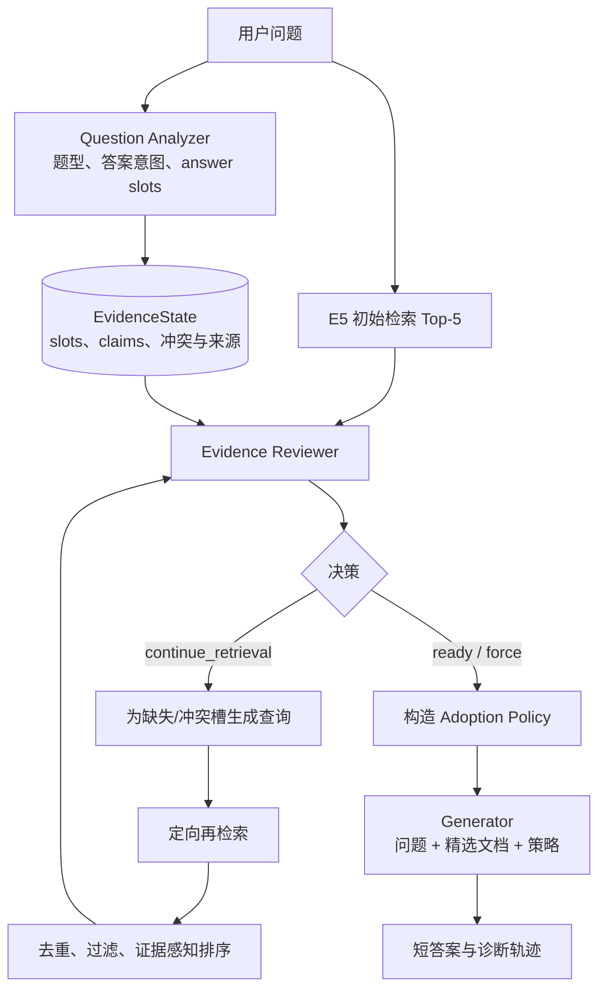

# Reviewer RAG：一种基于元认知审查的自适应RAG框架（架构设计与阶段性实验结果）

## 项目状态
当前仍处于研究进行阶段。本仓库主要用于展示框架设计、核心方法与阶段性实验结果。完整代码实现、实验流程与进一步评估仍在持续完善中，待项目稳定后逐步开放。

## 初步结果

下表为基于 Qwen2.5-7B-Instruct 的 EM/F1 指标（%）。受限于基础框架限制及实验公平性考虑，以下实验结果中本架构暂未启用混合检索机制，而采用与各基线方法一致的检索设置进行评估。

| 方法                   |            HotpotQA |               MuSiQue |     2WikiMultiHopQA |             Bamboogle |
| -------------------- | ------------------: | --------------------: | ------------------: | --------------------: |
| Naive RAG            |        31.2 / 42.37 |          10.8 / 18.44 |        26.4 / 33.20 |          20.8 / 29.79 |
| IRCoT                |        27.3 / 40.57 |          11.4 / 19.95 |                   — |          22.4 / 35.21 |
| Iter-RetGen          |        33.3 / 45.11 |          14.7 / 22.80 |        29.3 / 36.29 |          20.8 / 30.08 |
| CRAG                 |        33.2 / 43.15 |          10.2 / 18.11 |        25.2 / 33.31 |          24.8 / 32.74 |
| **Reviewer RAG**     |    **36.1 / 47.88** |      **19.4 / 26.93** |    **30.0 / 37.40** |      **32.0 / 41.27** |
| **相对最佳基线提升 (EM/F1)** | **+8.41% / +6.14%** | **+31.97% / +18.11%** | **+2.39% / +3.06%** | **+29.03% / +17.21%** |

Reviewer RAG 在所有数据集上均取得最佳性能，其中在 MuSiQue 和 Bamboogle 上提升最显著（平均分别提升 25.04% 和 23.12%）。 
这主要得益于 reviewer 机制对复杂多跳推理中的检索噪声和错误链路进行有效校验与修正，尤其适用于 MuSiQue 的多步组合推理和 Bamboogle 的高事实关联场景。在 HotpotQA 和 2WikiMultiHopQA 上，尽管基线性能较高，Reviewer RAG 仍保持稳定提升，验证了该机制在不同多跳问答任务中的有效性。

## 架构设计

现有RAG方法在处理**多跳推理、证据分散及文档冲突的复杂任务**时，容易出现证据覆盖不足、关联偏差和生成不可靠等问题。其主要原因在于，传统方法通常侧重检索相关性优化，缺乏对当前证据状态的显式评估与逻辑审查。 
为此，本文提出一种引入元认知审查机制的自适应检索增强生成框架，通过在检索与生成之间建立证据评估与决策过程，实现对检索行为和生成策略的联合调控。

该框架的核心是位于检索阶段与生成阶段之间的**元认知审查模块（Metacognitive Reviewer）**。系统首先对输入问题进行结构化分析，将复杂问题分解为若干与最终答案相关的**证据需求单元（answer slots）**；随后从候选文档中抽取原子化证据，并**建立证据需求与证据单元之间的对应关系**。审查模块综合评估证据的覆盖性、一致性与可信度，动态维护信息缺失（missing）、部分覆盖（partial）、充分支持（supported）和证据冲突（conflicted）等证据状态。

基于证据状态评估结果，框架能够**自适应决定后续检索与生成策略**：当关键证据缺失、覆盖不足或存在冲突时，元认知审查模块生成**针对性检索意图**，并可以动态调整**混合检索策略中的检索权重**，对相关信息进行定向补充；当证据达到充分支持条件时，系统停止检索，并指明**可采用的证据、需要排除的信息及冲突处理原则**，从而约束最终回答生成，降低无依据推断的风险。

整体上，该框架形成“问题分析—证据审查—自适应检索—策略引导生成”的闭环流程，通过显式建模证据状态与检索决策，使 RAG 系统由被动的信息调用模式转变为**受证据状态驱动的主动检索模式**。

## 限制与阶段

这些结果仍属于本地研究原型证据，而非定论：实验主要基于单一模型、单一种子和有限样本。项目目前已具备可复现实验、状态追踪和错误分析能力，但仍处于机制验证与消融阶段，距离稳定、低成本的生产系统尚有明显距离。
